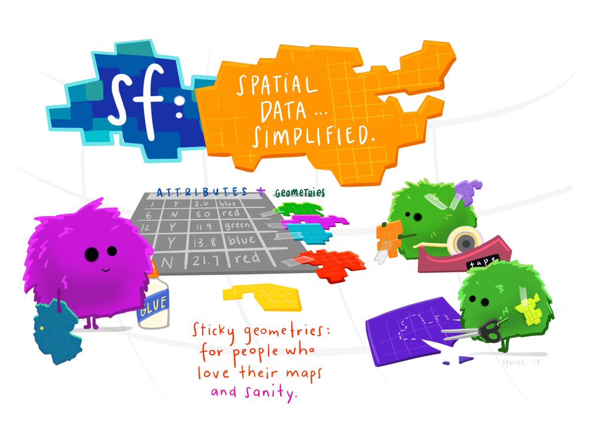
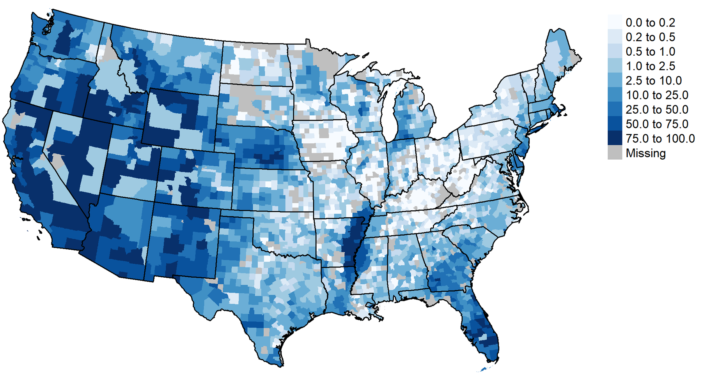
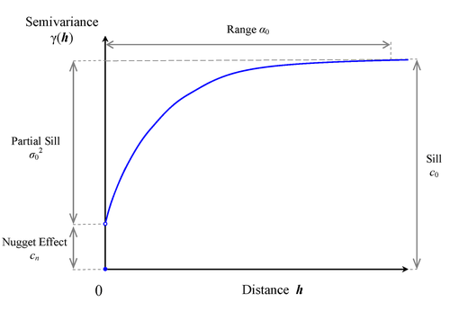

First things first, many thanks to Dr. Emily Burchfield for her Spatial Interpolation [materials](https://www.emilyburchfield.org/courses/gsa/interpolation_lab), which I adapted to `sf` for this guest lecture.

# 1. Setup and Data

In this exercise we will use `R` to conduct spatial interpolation analysis. We will focus on sample point data (e.g., weather station observations) of a spatially continuous variable (e.g., precipitation). For the remainder of this exercise, and for your extra credit assignment, we will utilize weather station precipitation data in California to create an interpolated & gridded surface of precipitation estimates for the entire state.

This week we will work with the `gstat` package to create interpolated surfaces in `R`. We will also use `tidyverse` and `sf`. Make sure you have these packages installed and loaded. We all know why `tidyverse` is so powerful, but do you know `sf`? 

<center>



</center>

It's a beautiful tool that simplifies spatial data; geometries in `sf` objects are sticky, so they remain with the data.frame unless the user otherwise drops them. We can interface the `tidyverse` and importantly, `ggplot` directly with `sf` for beautiful visualizations.


```{r message = F, warning = F}
# read in necessary packages
library(sf)
library(sp)
library(gstat)
library(tidyverse)

# read in data
p <- readRDS("./data/CA_precip_sf.RDS")
ctys <- readRDS("./data/coterm_cty_sf.RDS")
ca <- ctys %>% filter(STATEFP == "06")
ca <- st_transform(ca, st_crs(p))

```

# Exploration

We are going to utilize some precipitation data that's featured in [this](https://rspatial.org/raster/analysis/4-interpolation.html) RSpatial Module. I've manipulated the dataset from an aspatial .txt to an `sf` .RDS file. You can find the code to do this, [here](https://github.com/blschum/Spatial-Interpolation-GuestLecture); and you can find the data, [here](https://rspatial.org/analysis/data/precipitation.csv).

Before we do anything, we should always explore our data!

```{r}
glimpse(p)
```

Our precipitation dataset includes:

* Weather station ID & Name
* Coordinates of the weather stations (`LAT` & `LONG`), which have been transformed to sfc_points in the `geometry` column;
* The station's altitude (`ALT`); and,
* Precipitation (sum in mm) for each month of the year, e.g., `JAN`, `FEB`, etc. + the annual sum (`ANNUAL`).

Let's do some inspection to see what's happening under the hood.

```{r}
plot(p$ANNUAL, xlab = "Station ID", ylab = "Annual precipitation (mm)")
```

What do you notice? I see that annual precipitation at most of our stations is less than 600 mm, with a few stations receiving higher precipitation... this is wild considering how much of our food (~13% of all food, plus 99% of almonds, artichokes, figs, raisins, etc.) is grown in California. HELLO, CA irrigation -- turned the otherwise "Great American Desert" into a water-rich agricultural oasis!

<center>



</center>


Let's look at this piece of the puzzle another way:

```{r}
hist(p$ANNUAL, 100)
```

Interesting... but what we really want to see are spatial patterns in our data. Let's see if we can detect some just by visualizing our sf object with `ggplot`.

```{r}
ggplot(p) +
  geom_sf(aes(color = ANNUAL))
```

What do you think? I see a pretty noticeable spatial pattern in our precipitation data in CA. Given everything you know about CA, does the spatial pattern you see make sense? What regions of California are receiving the least or greatest amount of rain; do you have any guesses as to why?

Now let's imagine we want to take this collection of points, samples of measured precipitation data from weather stations, to generate a gridded dataset that estimates precipitation values in locations where we have no station data.

Like we discussed in lecture, we can use the spatial relatedness of our data (as per Tobler's First Law) to preform an interpolation that will create the smooth surface we just discussed!!

# Interpolation

As we discussed in lecture, there are various techniques for spatial interpolation. Your choice of these techniques depends on the data you are working with and the questions you are interested in answering. In this exercise, we will start by introducing a simple approach to interpolation called **inverse distance weighted (IWD) interpolation** and will then focus on the *art* of **kriging**.

## Inverse distance weighted (IWD) interpolation

First we need to build a grid on which to interpolate the data! We'll use the `ca` layer we created above by filtering on our `ctys` object.

```{r}

grd <- st_make_grid(ca, cellsize=20000, n = c(80,80), what = "polygons", square = TRUE)
plot(grd)

```

Woohooo, we've made a grid that sits on top of the state of California. PERFECT, just what we need to plug into the `idw()` function. We could have created a grid with smaller or larger cells by adjusting the *cellsize* parameter, above; we also coulod have adjusted the number of cells by adjusting the *n*, above. You can read more about creating grids, [here](https://stackoverflow.com/questions/43436466/create-grid-in-r-for-kriging-in-gstat).

This is **NOT** a raster object, but an `sf` polygon object required by the kriging and IDW functions we will use for interpolation.

With our grid and data in hand, interpolation via IDW is very straight forward!
```{r}
# iwd() function; remember, you can call ??spatstat::idw() for help!
p.idw <- idw(formula = ANNUAL ~ 1, p, grd,  idp = 2, nmax = 12)

# Plot the predicted grid values!
plot(p.idw["var1.pred"])
```

Based on our data, does our interpolated surface seem probable? Does it seem like IDW did a decent job? 

Here, we set values for *p* and *n* via the `idp` and `nmax` arguments in the `idw()` function. Like we discussed in lecture, the default for most *p* is 2, so we are using a relatively standard value; we are also utilizing *n* = 12 to define our neighborhood window. Changing these two values will affect the results of our interpolation--in your analyses and research, it is important to test the sensitivity of your results to different values of *p* and *n*. We also feed the function a formula `ANNUAL ~ 1`, which means were are only interested in how annual precipitation interacts with itself (only its x,y coordinates are used in the model), and our data, `psf` and our grid `grd`.

## Kriging

To perform kriging, we first need to calculate a **sample variogram**, or, put another way, the variogram produced from our data! We then have to find a **model variogram** that best fits our empirical/sample variogram. But why? What even is this thing called a variogram? Essentially, a [variogram](https://faculty.washington.edu/edford/Variogram.pdf) visualizes spatial relatedness (e.g., correlation) as a function of *lag*, or the physical distance between two observed points. We will first assume that our precipitation data are *isotropic*, or that our variogram properties are independent of direction. Then we'll look at *anisotropy* in our data, or whether our variogram properties depend on both *lag* and direction--this is important, right? We know that space matters and that phenomena like precipitation may be affected by direction--so we need to check!!

The `variogram()` function computes and plots all possible squared differences of observation pairs against their separation distance (*lag*).

```{r}
p.vgm <- variogram(ANNUAL ~ 1, p, cressie = T) # cressie = T computes robust measures for the sample variogram if you are worried about outliers!
plot(p.vgm)
```

The variogram, above, may remind you of a correlogram. It should!--the difference is that the values of semivariance are flipped--higher values of semivariance indicate that observation are less related. So, as Tobler's Law outlines, as distance increases, our semivariance increases.

There are 3 [things](https://pro.arcgis.com/en/pro-app/latest/help/analysis/geostatistical-analyst/understanding-a-semivariogram-the-range-sill-and-nugget.htm) we need to look out for when we see our variogram:

<center>



</center>

* The *nugget* is the distance between the origin (0,0) and where the variogram intersects the y-axis;
* The *sill* and *partial sill* represent the limits of the variogram; where does the variogram start to plateau?;
* The *range* is the distance at which the variogram approaches the sill value... where data is no longer correlated!

Like I said above, we need to check direction as well as lag:

```{r}
# this divides point pairs along their cardinal directions
vgm.dir<-variogram(ANNUAL~1,data=p,alpha=c(0,45,90,135))
plot(vgm.dir)
```

Any point pair between 22.5 and 67.5 degrees is placed in the 45 degree panel. These distances are in meters... the units of our precipitation datas' projection:

```{r}
p$geometry
```

Now we have to find a model variogram that fits our sample variogram best. We'll use this model for kriging.

`gstat` has quite a few model variograms available:

```{r}
show.vgms()
```

and....

```{r}
vgm()
```

First we have to look at the model variograms available and pick one we think looks reasonable for our data. I'm going to start with a exponential model:

```{r}
# fit model to sample
p.fit <- fit.variogram(p.vgm, model = vgm(psill = 200000, "Exp", range = 400000, nugget = 50000))
plot(p.vgm, pch = 20, cex = 1.5, col = "black", ylab = "Semivariance", xlab = "Distance (m)", model = p.fit)
```

`fit.variogram()` calls for your sample variogram and a `vgm()` object you construct. This should include an estimate of the `psill`, or partial sill, the `range`, and the `nugget`. These should come from your plots of your sample variogram we created, above. That looks like a pretty good representation of our data, but let's try another model to see if it fits any better! Next I'll try the Matern model:

```{r}
p.fit <- fit.variogram(p.vgm, model = vgm(psill = 200000, "Mat", range = 400000, nugget = 50000))
plot(p.vgm, pch = 20, cex = 1.5, col = "black", ylab = "Semivariance", xlab = "Distance (m)", model = p.fit)
```

This model seems to fit just as well as the exponential model. I'll use the Matern model for kriging. When you are fitting your modeled variogram, you should play with different model specifications; you can change the model itself, but also the `psill`, `range`, and `nugget` parameters based on your empirical (observed) data.

Since we've built a model variogram we are happy with, we can now use the `krige()` function to interpolate. `krige()` calls for us to specify the variable of interest we want to model (`ANNUAL ~ 1`), the original observation data (`p`), the grid on which we'll krige the data (`grd`), and the model variogram we created (`p.fit`).

NOW, let's **krige** to find estimated precipitation in areas where we had no observation data!

```{r}
p.krig <- krige(ANNUAL ~ 1, p, grd, model = p.fit)
plot(p.krig["var1.pred"])
```

### REMEMBER,

For ordinary kriging to apply to your data, the following assumptions need to hold:

* Observations are a partial realization of a random function Z(x) where x denotes spatial location.
* That the mean, spatial covariance and semivariance don’t depend on the location x.

Point 2 can be tricky, so you may need to [detrend](https://rspatial.org/raster/analysis/4-interpolation.html) your data first.

A few tips:

* Check for duplicates in your data! Kriging won’t work if you have multiple observations for the same point (unless you’re doing space-time kriging)
* **HOLD OUT** some of your data to check how well the model fits (see below!).
* Make sure your data is projected (very important!).

## Assessing fit

In order to understand how "well" our interpolated/kriged data fits our observations, we can "hold out" data. This means we'll remove a few weather stations from our original/observation dataset and see how well our modeled results predict the known values of precipitation at the held out stations. This is called [cross validation](https://towardsdatascience.com/why-and-how-to-cross-validate-a-model-d6424b45261f) and is used often when implementing machine learning algorythms. It's a fantastic way to see how generalizable our models are on "new"/unseen data!

First, we have to select a random subset of our data for training (creating our kriged/modeled data) and testing (seeing how well our model performs on held-out data):

```{r}
random_rn <- sample(nrow(p), 50)
p_test <- p[random_rn,] 
p_sample <- p[-random_rn,]
```

You can see that we've now created two `sf` objects; one with 406 observations for building our kriged surface and one with 50 observations for testing how well our kriged surface matches actual weather station observations.

Let's now create a kriged surface using our `p_sample` dataset:
```{r}
p.krig <- krige(ANNUAL ~ 1, p_sample, grd, model = p.fit)
plot(p.krig["var1.pred"])
```
We can now find the root mean squared error (RMSE), which measures the deviations between the observed and predicted precipitation values. Below, we create a function that will run through our kriged dataset and compare its `predicted` values to our `observed` values. We will use this function in a minute!
```{r}
RMSE <- function(observed, predicted) {
  sqrt(mean((predicted - observed)^2, na.rm=TRUE))
}
```

But first, we need to pull/extract the values from our kriged dataset to our `p_test` points.

```{r}
pred_precip <- st_intersection(p_test, p.krig["var1.pred"])
```

The prediction dataframe, above now contains our measured/original weather station data (`ANNUAL`) and our predictions at these stations (really... at the grid in which the station is located) (`var1.pred`). Let's compute the RMSE:

```{r}
rmse_precip <- RMSE(observed = pred_precip$ANNUAL, predicted = pred_precip$var1.pred)
rmse_precip
```

This RMSE is pretty huge... which means our models aren't doing stellar... but at least we are doing better than a null model where we use average precipitation across ALL stations to predict precipitation at any given station:

```{r}
null <- RMSE(mean(pred_precip$ANNUAL), pred_precip$var1.pred)
null
```

# Wanna learn more?

* A more detailed overview of both of these methods by Dr. Emily Bruchfield, [here](https://www.emilyburchfield.org/courses/gsa/interpolation_lab).
* An interesting tutorial on soil data, [here](http://pierreroudier.github.io/teaching/20171014-DSM-Masterclass-Hamilton/2017-09-28-simple-interpolation.html).
* Spatio-temporal kriging in R, [here](http://r-video-tutorial.blogspot.com/2015/08/spatio-temporal-kriging-in-r.html]).
* Interpolation in the RSpatial text, [here](https://rspatial.org/raster/analysis/4-interpolation.html).